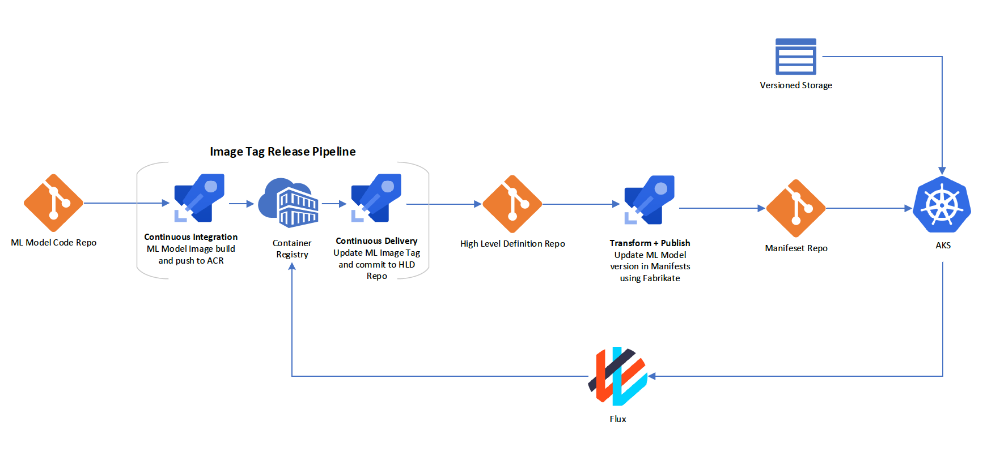

# Extending Bedrock to MLOps

[Bedrock](https://github.com/microsoft/bedrock) provides a consistent and reliable workflow for which applications can be deployed and managed using GitOps. By reusing a lot of the components in Bedrock, we find that GitOps can be a favorable approach for managing and deploying machine learning models as well.

Instead of applications or microservices, Bedrock can extend the CI/CD workflow to ML models. The key differences to consider here are:

1. ML Model Code Repo (as opposed to an Application Code Repo shown [here](https://github.com/microsoft/bedrock/blob/master/gitops/azure-devops/images/ado-two-processes-diagram.png)).

2. The addition of **versioned storage** for data ingestion in ML models.

## A Mini MLOps Narrative

_A path towards an experience for data scientists in managing machine learning models, where end-to-end CICD pipelines and git workflows are applied._

Frodo, who is a Data Scientist, has gotten into the habit of making quick iterations to his Visual Tagging Machine Learning models. He is finding it to be challenging to have to manually deploy the model every time it is updated, and wishes there is a way to automate this.

Frodo soon learns from his colleage, Gandalf, of [Bedrock](https://github.com/microsoft/bedrock) and finds that he can apply the Bedrock fundamentals towards building reproducible ML pipelines. Frodo checks in his ML models to a repository, and like an Application Code repository in Bedrock, it triggers an [**Image Tag Release Pipeline**](https://github.com/microsoft/bedrock/blob/master/gitops/azure-devops/ImageTagRelease.md), where his dockerized ML model is incrementally versioned, built, and pushed to an Azure Container Registry.

Upon this push, another pipeline is triggered to update the versioned Docker ML image in the [Fabrikate](https://github.com/microsoft/fabrikate) definitions of the HLD repository. When the Fabrikate definitions reflect the new Docker ML image, the [**Manifest Generation Pipeline**](https://github.com/microsoft/bedrock/blob/master/gitops/azure-devops/ManifestGeneration.md) kicks off, and updates the Kubernetes Manifests to ensure that the new ML model is rolled out to the cluster.

Meanwhile, Gandalf, who is a Data Engineer, assists with the ML operations by managing an Azure Blob storage that hosts training datasets and trained models. When additional data or models are versioned and pushed to the blob storage, it becomes available to the cluster for the models to train and infer on.

By doing this, Frodo and Gandalf are keeping the state of the ML models in Git, where code changes to the models are triggered, stored, validated, and fully audtiable in Git.
